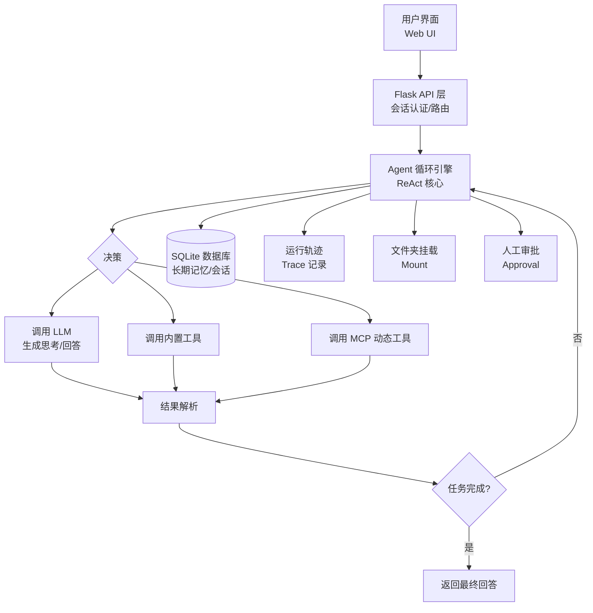

# Starlight

[EN](README_EN.md)

**个人自托管轻量级多模型 AI Agent**

[](https://www.python.org/downloads/)
[](https://flask.palletsprojects.com/)

**Starlight** 是一款功能完整、易于部署的个人 AI Agent。它通过统一的 OpenAI 兼容 API 接入主流大语言模型（LLM），并内置了强大的 **Agent 系统**、**长期记忆**与**文件夹挂载**能力，可实现复杂的任务规划与执行。

## ✨ 核心亮点

-   **🧠 智能 Agent 引擎**：内置 ReAct 循环，支持 13 个内置工具 + MCP 动态工具扩展。
-   **💡 长期记忆**：基于 SQLite 与 FTS5，实现跨会话的持久化记忆、自动提取、整合与衰减。
-   **📂 文件夹挂载**：将本地文件夹安全挂载给 Agent，实现跨目录文件读写。
-   **🌐 多模型支持**：一个界面，轻松切换 DeepSeek、小米 MIMO、OpenAI 等。
-   **🔒 五层安全防护**：从代码沙箱到权限控制，全方位保障运行安全。
-   **🚀 一键部署**：基于 Flask + Waitress，自托管，数据完全私有。

## 🚀 快速概览

Starlight 不仅仅是一款聊天工具，更是一个能自主执行复杂任务的智能助手。

```python
# 示例：通过 API 调用 Agent 执行一个需要联网搜索和代码执行的任务
import requests

response = requests.post(
    "http://127.0.0.1:8080/api/agent/chat",
    json={
        "message": "请帮我查找过去一周关于 'AI Agent' 的热门论文，总结它们的核心思想，并生成一个对比表格。",
        "session_id": "demo_session"
    }
)
print(response.json()['reply'])
# AI 会自动规划步骤：1. 调用 web_search 查找论文 2. 分析内容 3. 调用 execute_code 生成表格
```

## 📦 安装与启动

**环境要求**：Python 3.10+

项目内置了完整的**虚拟环境**与**一键部署**脚本，Windows 用户只需双击即可完成从安装到启动的全部流程。

### 🚀 方式一：一键部署（Windows 推荐）

项目根目录提供了 3 个即用型脚本，无需手动安装依赖：

| 脚本 | 作用 |
| :--- | :--- |
| `start.cmd` | **一键启动**服务器。若检测到 `venv/` 不存在，会自动先执行 `setup_venv.bat` 创建虚拟环境并安装依赖，随后以 4 个 worker 启动服务。 |
| `setup_venv.bat` | **一键搭建虚拟环境**。自动查找 Python，创建 `venv/` 并安装 `requirements.txt` 中的全部依赖（含失败时的逐包重试）。 |
| `backup.bat` | **一键备份**数据与配置到 `data/backups/`，并列出最近的备份。 |

**首次部署：**

```bash
# 1. 双击 setup_venv.bat，创建虚拟环境并安装依赖（仅需一次）
setup_venv.bat

# 2. 配置 API 密钥（见下方「配置」小节）

# 3. 双击 start.cmd 启动服务器
start.cmd
```

> 提示：`start.cmd` 会自动处理虚拟环境，若 `venv/` 已存在则直接启动，因此日常使用只需双击 `start.cmd` 即可。

### 🛠️ 方式二：手动安装（跨平台）

适用于 Linux / macOS / Windows 命令行，或需要自定义环境的情况：

```bash
# 1. 克隆仓库
git clone https://github.com/your-username/ai-chat.git
cd ai-chat

# 2. 创建并激活虚拟环境（强烈推荐，隔离项目依赖）
python -m venv venv
# Windows:
venv\Scripts\activate
# Linux / macOS:
source venv/bin/activate

# 3. 安装依赖
pip install -r requirements.txt

# 4. 配置 API 密钥（见下方「配置」小节）

# 5. 启动应用
python app.py

# 6. 访问应用，浏览器打开 http://127.0.0.1:8080
```

### 🧪 虚拟环境说明

- 项目使用 `venv/` 目录作为虚拟环境（当前为 Python 3.10.11），已包含 `python.exe`、`pip.exe` 等完整运行环境。
- `venv/` 已被 `.gitignore` 忽略，不会进入版本库，可随时删除后通过 `setup_venv.bat` 或手动命令重建。
- 手动激活方式：`venv\Scripts\activate`（Windows）或 `source venv/bin/activate`（Linux/macOS）；停用用 `deactivate`。

### 🔑 配置

API 密钥通过环境变量提供（`.env` 已被 git 忽略；密钥绝不写入任何代码/配置仓库文件）。

- **方式 A（推荐）**：在项目根目录创建 `.env` 文件：
  ```
  DEEPSEEK_API_KEY=sk-xxx
  XIAOMI_API_KEY=sk-xxx
  ```
  `data/config.yaml` 中的 `api_key` 字段通过 `${DEEPSEEK_API_KEY}` 这类占位符自动引用。
- **方式 B**：在系统中设置同名环境变量（Windows 设置界面保存的密钥会自动写入 `.env`）。

> 历史遗留说明：曾直接写入 `data/config.yaml` 的明文密钥已清理（该文件已被 git 忽略，但仍建议通过 `.env` 管理密钥）。

### ⚙️ 启动参数

```bash
python app.py              # 使用 config.yaml 中的 host/port（默认 127.0.0.1:8080）
python app.py -H 0.0.0.0   # 指定绑定地址
python app.py -p 9000      # 指定端口
python app.py --workers 8  # Waitress 工作线程数（默认 4）
```

### 👤 用户管理

应用将用户存储在 SQLite（`data/chat.db`）中，通过命令行脚本管理：

```bash
python manage_users.py add <username> <password>   # 创建用户
python manage_users.py delete <username>           # 删除用户
python manage_users.py list                        # 列出用户
```

> 旧版本将用户数据存储在 `data/users.json`，登录系统不读取该文件。如果你有历史用户数据，请先运行 `python data/migrate.py` 一次性导入。

### 💾 备份

- 一键备份：双击 `backup.bat`，或运行 `python data/backup.py backup`，备份归档保存至 `data/backups/`。
- 应用内置自动备份调度：服务器启动 30 秒后执行首次备份，此后每 24 小时自动备份一次（保留最近 30 份）。

## 🏗️ 系统架构



## 🔧 功能特性

### 核心智能
- **多模型接入**：统一接口，支持 DeepSeek、小米 MIMO、OpenAI 等主流服务。
- **Agent 系统**：基于 ReAct 循环的智能体，可自主思考、规划并调用工具完成任务。
- **计划执行**：采用 Plan-then-Execute 模式，将复杂任务拆解为可执行的子步骤，支持进度跟踪与周期性计划评审。
- **子代理委派**：支持 `research`、`code`、`full` 三种模式的任务分工，并对子代理时长与工具调用次数设限。
- **长期记忆**：持久化存储关键信息，FTS5 全文检索精准召回；支持自动提取、去重、整合、衰减与质量门控。
- **上下文压缩**：当 token 使用超过预算的 75% 时，自动调用 LLM 总结对话历史，支持跨会话持久化复用。
- **运行取消**：支持直接取消，或需要人工确认的取消模式。
- **人工审批**：关键操作可配置为人工介入审批，审批请求默认 300 秒后过期。
- **循环检测**：内置循环检测，防止 Agent 陷入死循环。
- **工具重试**：工具调用失败时，采用退避策略自动重试。

### 生产与运维
- **定时任务**：集成 APScheduler，支持 cron 风格的定时主动任务。
- **用户认证**：基于 Flask Session + Werkzeug 密码哈希的安全登录（含登录失败限流/锁定与 CSRF 防护）。
- **系统监控**：实时监控 CPU、内存、磁盘使用情况，以及请求量、LLM 调用量、token 消耗等指标。
- **告警引擎**：基于可配置阈值的系统告警，支持告警历史记录。
- **数据备份**：一键打包下载全部数据与配置，支持恢复；也支持自动周期备份。
- **全程追踪**：记录 Agent 每一步决策、工具调用与结果，支持 JSON 导出与回放。
- **文件上传**：支持用户上传文件作为 Agent 上下文或工作区素材。

### 文件夹挂载
- 将本地文件夹安全挂载给 Agent 使用，支持配置访问策略（读写或只读）。
- 挂载目录下的文件可通过 `mount:<id>/rel/path` 路径访问。
- 支持查看挂载清单、持久化挂载配置（`data/mounts.json`）与运行时文件隔离保护。

### 内置工具（13 个）

| 类别     | 工具名称                         | 说明                          |
| :------- | :------------------------------- | :---------------------------- |
| **网络** | `web_search`                     | 搜索网络信息                  |
|          | `get_weather`                    | 查询天气信息                  |
| **文件** | `read_file`、`read_files`        | 读取单个或多个文件            |
|          | `write_file`                     | 写入文件内容                  |
|          | `list_files`                     | 列出目录中的文件              |
| **代码** | `execute_code`                   | 在安全的 Python 沙箱中执行代码 |
| **记忆** | `memory_query`                   | 从长期记忆中检索相关信息      |
|          | `memory_store`                   | 将信息存入长期记忆            |
|          | `memory_forget`                  | 删除某条特定记忆              |
|          | `memory_list`                    | 列出所有记忆条目              |
| **LLM**  | `chat_completion`                | 嵌套 LLM 调用，用于生成或总结  |
| **Agent**| `delegate`                       | 将任务委派给指定的子代理      |

> 除内置工具外，还可通过 **MCP（Model Context Protocol）** 动态接入外部工具服务器。

### 安全机制（五层防护）

1.  **代码沙箱**：所有代码在隔离进程中执行，强制 30 秒超时。
2.  **文件隔离**：文件操作严格限定在指定的 `workspace` 目录，防止路径穿越。
3.  **权限控制**：基于角色的访问控制，保护核心功能。
4.  **限流机制**：API 调用与登录尝试均有限流，防止滥用与暴力破解。
5.  **输入校验**：对所有用户输入进行严格校验与清洗，防止注入攻击。

## ⚙️ 配置说明

主配置文件为 `data/config.yaml`。API 密钥通过 `.env` 环境变量注入，配置中的 `${ENV_NAME}` 占位符会自动替换。主要配置段：

| 配置段          | 说明                                          |
| :--------------- | :--------------------------------------------- |
| `active_backend` | 当前激活的模型后端名称                          |
| `llms.backends`  | 可用 LLM 后端列表（name/model/api_base/api_key）|
| `server`         | 监听地址与端口（默认 127.0.0.1:8080）          |
| `agent`          | 上下文窗口、执行超时、最大工具调用数、压缩参数  |
| `memory`         | 长期记忆开关、注入条数、去重/整合/衰减/清理参数 |
| `planning`       | 计划执行开关、评审频率与阈值                    |
| `approval`       | 人工审批开关、请求过期时间                      |
| `scheduled`      | 定时任务开关                                    |
| `subagent`       | 子代理最大时长与工具调用次数限制                |
| `tool_retry`     | 工具调用失败重试策略（次数与退避延迟）          |

## 📁 项目结构

```
AI-Chat/
├── app.py              # 应用入口（Flask 主应用：路由/CSRF/监控/上传）
├── auth.py             # 认证模块（Session + 密码哈希 + 登录限流）
├── manage_users.py     # 用户管理命令行工具
├── requirements.txt    # Python 依赖
├── pytest.ini          # 测试配置
├── agent/              # Agent 核心引擎
│   ├── __init__.py
│   ├── orchestrator.py # ReAct 循环编排器（核心）
│   ├── llm_client.py   # 统一 LLM 客户端
│   ├── presets.py      # 预设配置工厂
│   ├── scheduler.py    # 定时任务调度器
│   ├── cancellation.py # 运行取消支持
│   ├── retry.py        # 工具调用重试策略
│   ├── tools/          # 全部内置工具实现（base/registry 及各工具）
│   ├── memory/         # 长期记忆系统（service/extractor/segmenter/context_manager）
│   ├── security/       # 五层安全（sandbox/file_guard/permissions/rate_limiter/validator）
│   ├── planning/       # 计划生成与进度跟踪
│   ├── compression/    # 上下文压缩（manager/summarizer）
│   ├── approval/       # 人工审批（manager）
│   ├── mcp/            # MCP 服务器管理（manager）
│   ├── mount/          # 文件夹挂载（manager）
│   └── observability/  # 运行追踪（trace_recorder/storage）
├── data/               # 运行时数据目录（建议加入 .gitignore）
│   ├── config.yaml     # 主配置文件
│   ├── chat.db         # SQLite 数据库文件（用户/记忆/会话）
│   ├── database.py     # 数据库访问层
│   ├── migrate.py      # 历史用户数据迁移
│   ├── migrate_uploads.py # 上传文件迁移脚本
│   ├── alerts.py       # 告警引擎
│   ├── backup.py       # 备份与恢复
│   ├── mounts.json     # 文件夹挂载配置持久化
│   ├── conversations/  # 会话记录目录
│   ├── traces/         # 运行轨迹记录目录
│   ├── uploads/        # 用户上传文件目录
│   ├── alerts/         # 告警历史记录
│   └── backups/        # 自动备份归档
├── templates/          # Jinja2 HTML 模板
├── static/             # 前端静态资源（CSS、JS、图片）
├── tests/              # 自动化测试套件（22 个测试模块）
├── eval/               # Agent 评估框架（runner/tasks/report/run_eval）
└── README.md           # 本文档
```

## 🛠️ 技术栈

| 组件           | 技术                               | 说明                              |
| :------------- | :--------------------------------- | :-------------------------------- |
| **Web 框架**   | Flask 3.x + Waitress 3.x           | 轻量、生产级 WSGI 服务器          |
| **数据库**     | SQLite（WAL 模式 + FTS5）          | 轻量免维护，高效全文检索          |
| **模板引擎**   | Jinja2                             | 灵活的 HTML 模板渲染              |
| **配置**       | PyYAML                             | 清晰可读的 YAML 配置文件          |
| **HTTP 客户端**| requests                           | 用于调用外部 LLM API 与工具       |
| **系统监控**   | psutil                             | 系统信息：CPU、内存、磁盘等       |
| **Token 计数** | tiktoken                           | 精确统计 LLM token 消耗           |
| **工具协议**   | MCP SDK（`mcp>=2.0`）              | 实现 Model Context Protocol 动态工具 |
| **定时任务**   | APScheduler                        | 可靠的 cron 任务调度              |
| **认证**       | Werkzeug                           | 安全的密码哈希与会话管理          |

## 🧪 测试与评估

项目包含完整的质量保障体系：

- **自动化测试套件**：包含 **22** 个测试模块（位于 `tests/` 目录），覆盖核心功能与边界情况，包括 Agent 编排、记忆、MCP、审批、压缩、调度、安全、上传、超时、循环检测与计划评审等。
- **评估框架**：`eval/` 目录提供 `runner.py`、`tasks.py`、`report.py`、`run_eval.py` 等模块，用于系统评估 Agent 的任务完成质量、工具调用准确率等指标，并支持生成评估报告。

### Agent 全量评测报告

- 评测时间: 2026-08-04
- 任务数: **25** | 通过率: **100.0%** (25/25)
- 总耗时: 579.2s | 总 tokens: 270,775 | 总工具调用: 63
- 后端: Xiaomi MIMO (mimo-v2.5) / DeepSeek (deepseek-v4-flash) — 按需切换
- 环境: 每任务独立沙箱工作区, 确定性检查 + LLM judge 双轨验证

#### 难度分布

| 难度 | 任务数 | 通过率 |
| --- | --- | --- |
| 简单 | 7 | 100% (7/7) |
| 中等 | 12 | 100% (12/12) |
| 困难 | 6 | 100% (6/6) |

#### 按能力域

| 能力域 | 任务数 | 通过率 |
| --- | --- | --- |
| 项目分析 | 5 | 100% (5/5) |
| 代码执行 | 7 | 100% (7/7) |
| 数据处理 | 2 | 100% (2/2) |
| 调试 | 2 | 100% (2/2) |
| 边界 | 1 | 100% (1/1) |
| 文件操作 | 7 | 100% (7/7) |
| 规划 | 2 | 100% (2/2) |
| 问答 | 6 | 100% (6/6) |
| 安全 | 1 | 100% (1/1) |
| 源码阅读 | 1 | 100% (1/1) |
| 网络搜索 | 2 | 100% (2/2) |

#### 逐任务明细

| 任务 | 难度 | 能力域 | 结果 | 耗时 | 工具调用 | Tokens | 判定方式 |
| --- | --- | --- | --- | --- | --- | --- | --- |
| file_hello | 简单 | 文件操作 | ✅ | 26.3s | 2 | 7,899 | 确定性检查 |
| file_notes | 中等 | 文件操作 | ✅ | 36.0s | 3 | 13,241 | 确定性检查 |
| file_csv | 中等 | 文件操作 | ✅ | 25.8s | 2 | 8,440 | 确定性检查 |
| file_organize | 中等 | 文件操作 | ✅ | 38.7s | 4 | 10,369 | 确定性检查 |
| code_fib | 中等 | 代码执行 | ✅ | 35.3s | 3 | 16,714 | 确定性检查 |
| code_stats | 中等 | 代码执行 | ✅ | 35.5s | 4 | 18,042 | 确定性检查 |
| code_square | 中等 | 代码执行 | ✅ | 36.9s | 2 | 10,852 | 确定性检查 |
| proj_structure | 困难 | 项目分析 | ✅ | 34.7s | 2 | 16,063 | 确定性检查 |
| proj_agentdir | 中等 | 项目分析 | ✅ | 34.2s | 3 | 10,331 | 确定性检查 |
| web_news | 中等 | 网络搜索 | ✅ | 35.5s | 16 | 60,990 | 确定性检查 |
| web_fib_formula | 中等 | 网络搜索 | ✅ | 30.0s | 3 | 13,936 | 确定性检查 |
| qa_capital | 简单 | 问答 | ✅ | 1.9s | 0 | 2,466 | 确定性检查 |
| qa_water | 简单 | 问答 | ✅ | 6.6s | 0 | 2,543 | 确定性检查 |
| qa_sort | 简单 | 问答 | ✅ | 2.1s | 0 | 2,464 | 确定性检查 |
| qa_python | 简单 | 问答 | ✅ | 3.1s | 0 | 2,597 | 确定性检查 |
| qa_translate | 简单 | 问答 | ✅ | 14.5s | 1 | 5,182 | 确定性检查 |
| qa_summary | 中等 | 问答 | ✅ | 8.0s | 0 | 2,569 | LLM judge |
| plan_multi | 困难 | 规划 | ✅ | 21.1s | 3 | 6,051 | 确定性检查 |
| plan_report | 中等 | 规划 | ✅ | 26.7s | 2 | 8,671 | 确定性检查 |
| edge_refuse | 中等 | 安全 | ✅ | 3.7s | 0 | 2,577 | LLM judge |
| edge_empty | 简单 | 边界 | ✅ | 7.8s | 0 | 2,471 | 确定性检查 |
| hard_debug | 困难 | 代码执行 | ✅ | 31.3s | 3 | 9,067 | 确定性检查 |
| hard_analysis | 困难 | 代码执行 | ✅ | 31.6s | 4 | 19,072 | 确定性检查 |
| hard_source_read | 困难 | 项目分析 | ✅ | 17.0s | 2 | 8,157 | 确定性检查 |
| hard_compare | 困难 | 代码执行 | ✅ | 35.0s | 4 | 10,011 | 确定性检查 |

## 📝 更新日志

### v1.0.0
- 🎉 **首个版本**
- 实现了完整的多模型聊天界面
- 构建了 ReAct 循环 Agent 引擎
- 集成了 13 个内置工具，支持 MCP 协议
- 完成了长期记忆系统（SQLite + FTS5）
- 实现了用户认证与登录限流保护
- 实现了文件夹挂载与人工审批机制
- 部署了系统监控、告警与备份功能
- 提供了 22 个测试模块与基础评估框架
