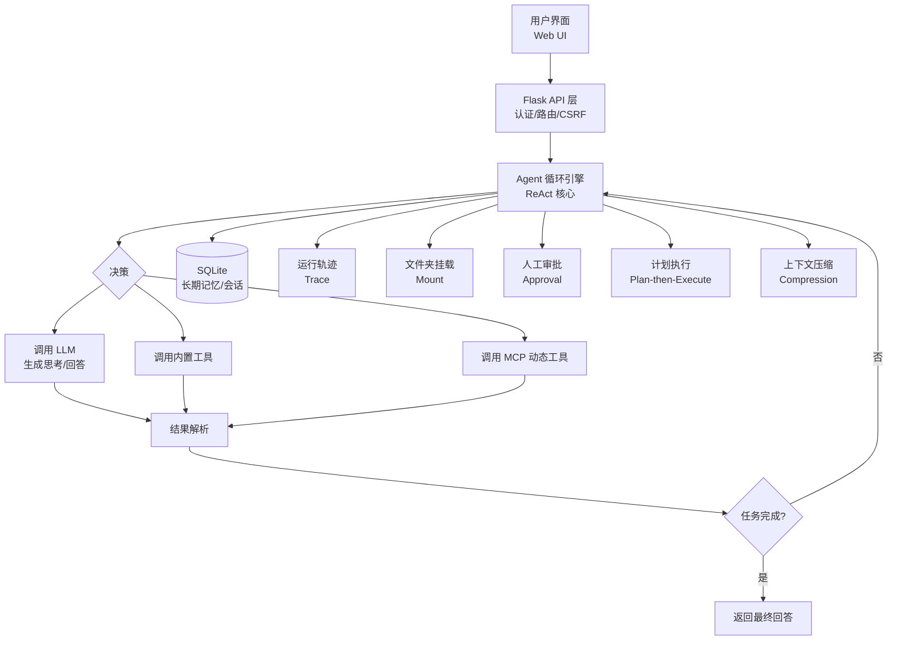

# Starlight

[English](README_EN.md)

**个人自托管、开箱即用的多模型 AI 智能体应用** —— 从日常问答到复杂任务自主执行，一个应用全部搞定。

[](https://www.python.org/downloads/)
[](https://flask.palletsprojects.com/)
[](https://www.sqlite.org/)
[](tests/)

**Starlight** 不是又一个聊天玩具，而是一套完整的 **Agent 工程化方案**：内置 ReAct 循环、计划执行、长期记忆、上下文压缩、子代理、人工审批、MCP 扩展、可观测性与评估体系。它把大模型从"对话工具"升级为"能自主干活的下属"。

---

## 🥇 与其他 Agent 项目的差异与优势

市面上多数 Agent 项目存在三类痛点：**要么只做对话**（没有真正的工具调用闭环）、**要么重框架轻落地**（部署复杂、没有 UI、没有评估）、**要么能力单一**（只会写代码或只会检索）。Starlight 的设计目标就是同时解决这三类问题：

### 1. 全栈 Agent 能力，不靠"套壳"组装

| 能力 | 多数 ChatUI / Agent 项目 | **Starlight** |
| :--- | :--- | :--- |
| 工具调用 | 仅演示级 1–2 个工具 | **14 个内置工具** + MCP 动态扩展，文件/代码/网络/记忆/子代理全覆盖 |
| 复杂任务 | 单轮 ReAct，无规划 | **Plan-then-Execute**：LLM 拆解步骤 → 进度跟踪 → 周期性 LLM 评审修正 |
| 长对话 | 截断丢上下文 | **上下文压缩**：token 超预算 75% 自动 LLM 总结，跨会话持久化复用 |
| 长期记忆 | 无 | **SQLite+FTS5 记忆库**：自动提取、去重、冲突消解、整合、衰减、质量门控 |
| 多步骤工具流 | 无保护 | 循环检测、失败循环熔断、工具重试、预算上限、超时兜底 |

### 2. 真·人工参与（Human-in-the-Loop），不是"给个开关"了事

- **审批记忆**：一次批准"本次任务内不再询问"，长任务不烦人；拒绝的也记住，不再骚扰。
- **运行中取消**：思考中也能取消（LLM 阻塞调用可中断）；任务模式先确认再停。
- **可配置审批**：写文件/执行代码/删记忆/子代理均可设审批，300s 自动过期，防遗漏。

### 3. 可观测 + 可评估，能"看见"Agent 在想什么

- **流式思考过程**：模型推理实时显示（💭 可折叠），工具调用活动逐行呈现——Agent 每一步都有迹可循。
- **全程 Trace 回放**：LLM 调用、工具链、token 消耗、结束原因全记录，JSON 导出、失败复盘。
- **内置评估框架**：25 个任务（简单/中等/困难 × 文件/代码/网络/规划/问答等 11 个能力域），确定性检查 + LLM judge 双轨验证，**全量通过率 100%**。

### 4. 部署简单到"双击即用"，却五脏俱全

- **零框架负担**：Flask + SQLite + 原生 JS，无 Node 构建、无 Docker 依赖、无微服务。
- **Windows 一键部署**：`setup_venv.bat` + `start.cmd`，双击完成安装到启动。
- **生产级周边**：认证/CSRF/限流、系统监控、告警、自动备份、定时任务（cron）、文件上传、多用户。
- **数据完全私有**：所有数据在本地 SQLite，密钥走 `.env` 环境变量，绝不落盘明文。

### 5. 安全不是口号，是五层实现

代码沙箱（隔离进程+超时）、文件路径隔离（防穿越）、角色权限、API/登录限流、输入校验——全部有测试覆盖。

> **一句话总结**：Starlight 是"一个人也能维护的生产级 Agent 平台"——对话体验像 ChatGPT，工程能力接近企业级框架，复杂度却只有它们的十分之一。

---

## ✨ 核心亮点

- **🧠 智能 Agent 引擎**：ReAct 循环 + 计划执行 + 进度评审，14 个内置工具 + MCP 动态扩展。
- **💡 长期记忆**：SQLite + FTS5，自动提取、去重、冲突消解、整合与衰减。
- **📂 文件夹挂载**：本地文件夹安全挂载给 Agent，按会话隔离、权限策略可选。
- **🎯 人工审批**：关键操作人工把关，审批记忆 + 可取消，人机协作不失控。
- **🌐 多模型支持**：一个界面切换 DeepSeek、小米 MIMO、OpenAI 等（OpenAI 兼容 API 任意接入）。
- **📊 全程可观测**：流式思考、Trace 回放、评估框架，Agent 行为透明可信。
- **🔒 五层安全防护**：从代码沙箱到权限控制，全方位保障。
- **🚀 一键部署**：Flask + Waitress 自托管，数据完全私有。

## 🚀 快速体验

Starlight 不只是聊天工具，更是能自主执行复杂任务的智能助手：

```python
import requests

response = requests.post(
    "http://127.0.0.1:8080/api/agent/chat",
    json={
        "message": "请帮我查找过去一周关于 'AI Agent' 的热门论文，总结核心思想，并生成对比表格。",
        "session_id": "demo_session"
    }
)
print(response.json()['reply'])
# AI 会自动：1. 规划步骤 2. web_search 找论文 3. 分析总结 4. execute_code 生成表格
```

Web 界面中，你可以看到模型的**思考过程实时流式输出**、每一步**工具调用活动**，任务执行全程透明。

## 📦 安装与启动

**环境要求**：Python 3.10+

### 🚀 方式一：一键部署（Windows 推荐）

项目根目录提供 3 个即用型脚本：

| 脚本 | 作用 |
| :--- | :--- |
| `start.cmd` | **一键启动**服务器。若 `venv/` 不存在会自动先执行 `setup_venv.bat`，随后以 4 worker 启动。 |
| `setup_venv.bat` | **一键搭建虚拟环境**。自动查找 Python，创建 `venv/` 并安装全部依赖（失败逐包重试）。 |
| `backup.bat` | **一键备份**数据与配置到 `data/backups/`。 |

```bash
setup_venv.bat   # 1. 首次：创建虚拟环境并安装依赖
# 2. 配置 API 密钥（见下）
start.cmd        # 3. 日常：双击即可启动
```

### 🛠️ 方式二：手动安装（跨平台）

```bash
git clone https://github.com/your-username/ai-chat.git
cd ai-chat
python -m venv venv
# Windows: venv\Scripts\activate   Linux/macOS: source venv/bin/activate
pip install -r requirements.txt
python app.py    # 浏览器打开 http://127.0.0.1:8080
```

### 🔑 配置

API 密钥通过环境变量提供（`.env` 已被 git 忽略，密钥绝不写入任何代码/配置仓库文件）：

- **方式 A（推荐）**：项目根目录创建 `.env`：
  ```
  DEEPSEEK_API_KEY=sk-xxx
  XIAOMI_API_KEY=sk-xxx
  ```
  `data/config.yaml` 中用 `${DEEPSEEK_API_KEY}` 占位符引用。
- **方式 B**：在系统中设置同名环境变量（设置界面保存的密钥会自动写入 `.env`）。

### ⚙️ 启动参数

```bash
python app.py              # 使用 config.yaml 的 host/port（默认 127.0.0.1:8080）
python app.py -H 0.0.0.0   # 指定绑定地址
python app.py -p 9000      # 指定端口
python app.py --workers 8  # Waitress 工作线程数（默认 4）
```

### 👤 用户管理

```bash
python manage_users.py add <username> <password>   # 创建用户
python manage_users.py delete <username>           # 删除用户
python manage_users.py list                        # 列出用户
```

> 旧版 `data/users.json` 用户数据可通过 `python data/migrate.py` 一次性导入。

### 💾 备份

- 手动：双击 `backup.bat` 或 `python data/backup.py backup`，归档到 `data/backups/`。
- 自动：启动 30 秒后首次备份，此后每 24 小时一次（保留最近 30 份）。

## 🏗️ 系统架构



## 🔧 功能特性

### 核心智能
- **多模型接入**：统一 OpenAI 兼容接口，支持 DeepSeek、小米 MIMO、OpenAI 等，界面一键切换。
- **Agent 系统**：ReAct 循环，可自主思考、规划并调用工具完成任务。
- **计划执行**：Plan-then-Execute 模式拆解复杂任务，进度跟踪 + 周期 LLM 评审（可标记漏步、纠正误判）。
- **子代理委派**：`research` / `code` / `full` 三种模式，子代理独立预算（25 次调用 / 300s），禁止嵌套。
- **长期记忆**：FTS5 全文检索精准召回；自动提取、去重、冲突消解、整合、衰减、质量门控。
- **上下文压缩**：token 超预算 75% 自动 LLM 总结，压缩收益不足自动跳过，跨会话持久化复用。
- **运行取消**：思考/工具阻塞中均可中断；任务模式需人工确认。
- **人工审批**：写文件/执行代码/删记忆/子代理可配置审批，默认 300s 过期，审批记忆避免重复打扰。
- **循环防护**：同参调用循环检测、8 连败熔断、空参阈值、工具重试退避、300 次调用预算、600s 超时。

### 生产与运维
- **定时任务**：APScheduler + cron 表达式，结果自动回写对话，手动触发 + 历史记录。
- **用户认证**：Session + Werkzeug 密码哈希，登录限流/锁定 + CSRF 防护。
- **系统监控**：CPU/内存/磁盘实时监控，请求量、LLM 调用、token 消耗等指标。
- **告警引擎**：可配置阈值告警，历史记录。
- **数据备份**：一键打包/恢复，自动周期备份。
- **全程追踪**：Agent 每步决策、工具调用与结果记录，Trace 页回放，JSON 导出。
- **文件上传**：按会话归档，多模态图片直传（模型支持时），文本/代码文件注入上下文。

### 文件夹挂载
- 本地文件夹安全挂载，读写/只读/总是询问策略可选。
- **按会话隔离**：挂载只属于发起它的对话，切换会话不串挂载。
- 挂载文件自动作为附件携带清单，Agent 可直接读写；`data/mounts.json` 持久化。

### Skill 技能系统
- `skills/` 目录即插即用：每个子目录一个 `SKILL.md` 就是一个技能。
- 对话级技能注入（作为附加 system 消息），可预选、随会话切换。

### 内置工具（14 个）

| 类别 | 工具 | 说明 |
| :--- | :--- | :--- |
| **网络** | `web_search` / `get_weather` | 网络搜索 / 天气查询 |
| **文件** | `read_file` / `read_files` / `write_file` / `list_files` | 读写文件、批量读取、目录列表 |
| **代码** | `execute_code` | 隔离沙箱中执行 Python 代码 |
| **记忆** | `memory_query` / `memory_store` / `memory_forget` / `memory_list` | 长期记忆增删查列 |
| **LLM** | `chat_completion` | 嵌套 LLM 调用（生成/总结） |
| **Agent** | `delegate` | 委派任务给子代理 |

> 此外可通过 **MCP（Model Context Protocol）** 动态接入任意外部工具服务器，支持 stdio / HTTP 传输，配置热加载。

### 安全机制（五层防护）

1. **代码沙箱**：隔离进程执行，强制超时；运行时拦截危险操作（删除/重命名/system 等），工作区外删除被拒。
2. **文件隔离**：文件操作严格限定 workspace，防路径穿越。
3. **权限控制**：基于角色的访问控制（USER/GUEST/ADMIN），工具级权限类别。
4. **限流机制**：API 调用与登录尝试限流，防滥用与暴力破解。
5. **输入校验**：严格校验清洗所有用户输入，防注入。

## ⚙️ 配置说明

主配置 `data/config.yaml`，密钥走 `.env`（`${ENV_NAME}` 占位符自动替换）。主要配置段：

| 配置段 | 说明 |
| :--- | :--- |
| `active_backend` | 当前激活的模型后端 |
| `llms.backends` | LLM 后端列表（name/model/api_base/api_key） |
| `server` | 监听地址与端口 |
| `agent` | 上下文窗口、执行超时、最大工具调用、压缩参数 |
| `memory` | 记忆开关、注入条数、去重/冲突/整合/衰减/清理 |
| `planning` | 计划执行开关、评审频率与阈值 |
| `approval` | 审批开关、过期时间、审批记忆 |
| `scheduled` | 定时任务开关 |
| `subagent` | 子代理时长与调用上限 |
| `tool_retry` | 工具重试策略（次数与退避） |

## 📁 项目结构

```
AI-Chat/
├── app.py              # Flask 主应用（路由/CSRF/监控/上传/流式）
├── auth.py             # 认证模块（Session + 密码哈希 + 登录限流）
├── manage_users.py     # 用户管理 CLI
├── requirements.txt    # 依赖清单
├── pytest.ini          # 测试配置
├── agent/              # ★ Agent 核心引擎
│   ├── orchestrator.py # ReAct 循环编排器（核心）
│   ├── llm_client.py   # 统一 LLM 客户端（多模态/视觉检测）
│   ├── presets.py      # 预设配置工厂
│   ├── scheduler.py    # 定时任务调度器
│   ├── cancellation.py # 运行取消（阻塞调用可中断）
│   ├── retry.py        # 工具重试策略
│   ├── tools/          # 14 个内置工具
│   ├── memory/         # 长期记忆（service/extractor/segmenter/context_manager）
│   ├── security/       # 五层安全（sandbox/file_guard/permissions/rate_limiter/validator）
│   ├── planning/       # 计划生成 + 进度跟踪 + LLM 评审
│   ├── compression/    # 上下文压缩（manager/summarizer）
│   ├── approval/       # 人工审批（manager）
│   ├── mcp/            # MCP 服务器管理
│   ├── mount/          # 文件夹挂载
│   └── observability/  # 运行追踪（trace_recorder/storage）
├── data/               # 运行时数据（config.yaml/chat.db/backups/...）
├── skills/             # ★ Skill 技能目录（每个子目录 = 一个技能）
├── templates/          # Jinja2 模板（index/traces/scheduled/login）
├── static/             # 前端资源（CSS/JS/图片）
├── tests/              # 23 个测试模块，270+ 用例
├── eval/               # ★ Agent 评估框架（runner/tasks/report/run_eval）
└── README.md
```

## 🛠️ 技术栈

| 组件 | 技术 | 说明 |
| :--- | :--- | :--- |
| **Web 框架** | Flask 3.x + Waitress 3.x | 轻量、生产级 WSGI |
| **数据库** | SQLite（WAL + FTS5） | 轻量免维护，高效全文检索 |
| **模板引擎** | Jinja2 | HTML 模板渲染 |
| **配置** | PyYAML | 可读的 YAML 配置 |
| **HTTP 客户端** | requests | 调用 LLM API 与工具 |
| **系统监控** | psutil | CPU/内存/磁盘 |
| **Token 计数** | tiktoken | 精确 token 统计 |
| **工具协议** | MCP SDK（`mcp>=2.0`） | Model Context Protocol 动态工具 |
| **定时任务** | APScheduler | cron 任务调度 |
| **认证** | Werkzeug | 密码哈希与会话管理 |

## 🧪 测试与评估

### 自动化测试

- **23 个测试模块、270+ 用例**（`tests/`），覆盖：Agent 编排、记忆、规划、MCP、审批、取消、压缩、调度、安全、上传、超时、循环检测、计划评审、评估框架等。
- 前端交互另有 jsdom 模拟测试（流式思考渲染、审批卡片、挂载预选、输入框状态机等）。

### Agent 评估框架（`eval/`）

- **25 个评估任务**：简单 7 / 中等 12 / 困难 6，覆盖文件操作、代码执行、项目分析、网络搜索、规划、问答、安全、边界等 11 个能力域。
- 每个任务独立沙箱工作区；**确定性检查 + LLM judge 双轨验证**；支持 `--repeat N` 稳定性复测、难度过滤。
- 报告自动生成 Markdown + JSON（`eval/reports/`），含耗时、token、工具调用明细。

### 全量评测报告（2026-08-04）

- 任务数：**25** | 通过率：**100.0%** (25/25)
- 总耗时 579.2s | 总 tokens 270,775 | 总工具调用 63
- 后端：Xiaomi MIMO (mimo-v2.5) / DeepSeek (deepseek-v4-flash) 按需切换

| 难度 | 任务数 | 通过率 | | 能力域 | 任务数 | 通过率 |
| :--- | :--- | :--- | :--- | :--- | :--- | :--- |
| 简单 | 7 | 100% | | 项目分析 | 5 | 100% |
| 中等 | 12 | 100% | | 代码执行 | 7 | 100% |
| 困难 | 6 | 100% | | 数据处理 | 2 | 100% |
| | | | | 调试 | 2 | 100% |
| | | | | 边界 | 1 | 100% |
| | | | | 文件操作 | 7 | 100% |
| | | | | 规划 | 2 | 100% |
| | | | | 问答 | 6 | 100% |
| | | | | 安全 | 1 | 100% |
| | | | | 源码阅读 | 1 | 100% |
| | | | | 网络搜索 | 2 | 100% |

### 逐任务明细

| 任务 | 难度 | 能力域 | 结果 | 耗时 | 工具调用 | Tokens | 判定 |
| :--- | :--- | :--- | :--- | :--- | :--- | :--- | :--- |
| file_hello | 简单 | 文件操作 | ✅ | 26.3s | 2 | 7,899 | 确定性 |
| file_notes | 中等 | 文件操作 | ✅ | 36.0s | 3 | 13,241 | 确定性 |
| file_csv | 中等 | 文件操作 | ✅ | 25.8s | 2 | 8,440 | 确定性 |
| file_organize | 中等 | 文件操作 | ✅ | 38.7s | 4 | 10,369 | 确定性 |
| code_fib | 中等 | 代码执行 | ✅ | 35.3s | 3 | 16,714 | 确定性 |
| code_stats | 中等 | 代码执行 | ✅ | 35.5s | 4 | 18,042 | 确定性 |
| code_square | 中等 | 代码执行 | ✅ | 36.9s | 2 | 10,852 | 确定性 |
| proj_structure | 困难 | 项目分析 | ✅ | 34.7s | 2 | 16,063 | 确定性 |
| proj_agentdir | 中等 | 项目分析 | ✅ | 34.2s | 3 | 10,331 | 确定性 |
| web_news | 中等 | 网络搜索 | ✅ | 35.5s | 16 | 60,990 | 确定性 |
| web_fib_formula | 中等 | 网络搜索 | ✅ | 30.0s | 3 | 13,936 | 确定性 |
| qa_capital | 简单 | 问答 | ✅ | 1.9s | 0 | 2,466 | 确定性 |
| qa_water | 简单 | 问答 | ✅ | 6.6s | 0 | 2,543 | 确定性 |
| qa_sort | 简单 | 问答 | ✅ | 2.1s | 0 | 2,464 | 确定性 |
| qa_python | 简单 | 问答 | ✅ | 3.1s | 0 | 2,597 | 确定性 |
| qa_translate | 简单 | 问答 | ✅ | 14.5s | 1 | 5,182 | 确定性 |
| qa_summary | 中等 | 问答 | ✅ | 8.0s | 0 | 2,569 | LLM judge |
| plan_multi | 困难 | 规划 | ✅ | 21.1s | 3 | 6,051 | 确定性 |
| plan_report | 中等 | 规划 | ✅ | 26.7s | 2 | 8,671 | 确定性 |
| edge_refuse | 中等 | 安全 | ✅ | 3.7s | 0 | 2,577 | LLM judge |
| edge_empty | 简单 | 边界 | ✅ | 7.8s | 0 | 2,471 | 确定性 |
| hard_debug | 困难 | 代码执行 | ✅ | 31.3s | 3 | 9,067 | 确定性 |
| hard_analysis | 困难 | 代码执行 | ✅ | 31.6s | 4 | 19,072 | 确定性 |
| hard_source_read | 困难 | 项目分析 | ✅ | 17.0s | 2 | 8,157 | 确定性 |
| hard_compare | 困难 | 代码执行 | ✅ | 35.0s | 4 | 10,011 | 确定性 |

## 📝 更新日志

### v1.1.0
- 🎉 定位升级：从"多模型聊天"到"全栈 Agent 平台"
- **差异与优势文档化**：新增"与其他 Agent 项目的差异"章节
- 输入框状态机：空态 3 倍高 + 贴齐示例按钮 + 按钮独立行（严格状态机 + CSS 过渡）
- 挂载按会话隔离、挂载即生效；Skill 技能系统（目录即技能）
- 流式思考过程实时显示、运行中取消（阻塞调用可中断）、审批记忆
- 流式 SSE 传输（思考/工具活动/文本实时）、多模态图片直传（含视觉降级）
- 评估框架 v2：难度体系 + 稳定性复测（25 任务 100% 通过）

### v1.0.0
- 🎉 **首个版本**
- 多模型聊天界面 + ReAct 循环 Agent 引擎
- 14 个内置工具 + MCP 协议支持
- 长期记忆系统（SQLite + FTS5）
- 用户认证与登录限流
- 文件夹挂载 + 人工审批
- 监控、告警、备份、定时任务
- 23 个测试模块 + 评估框架
