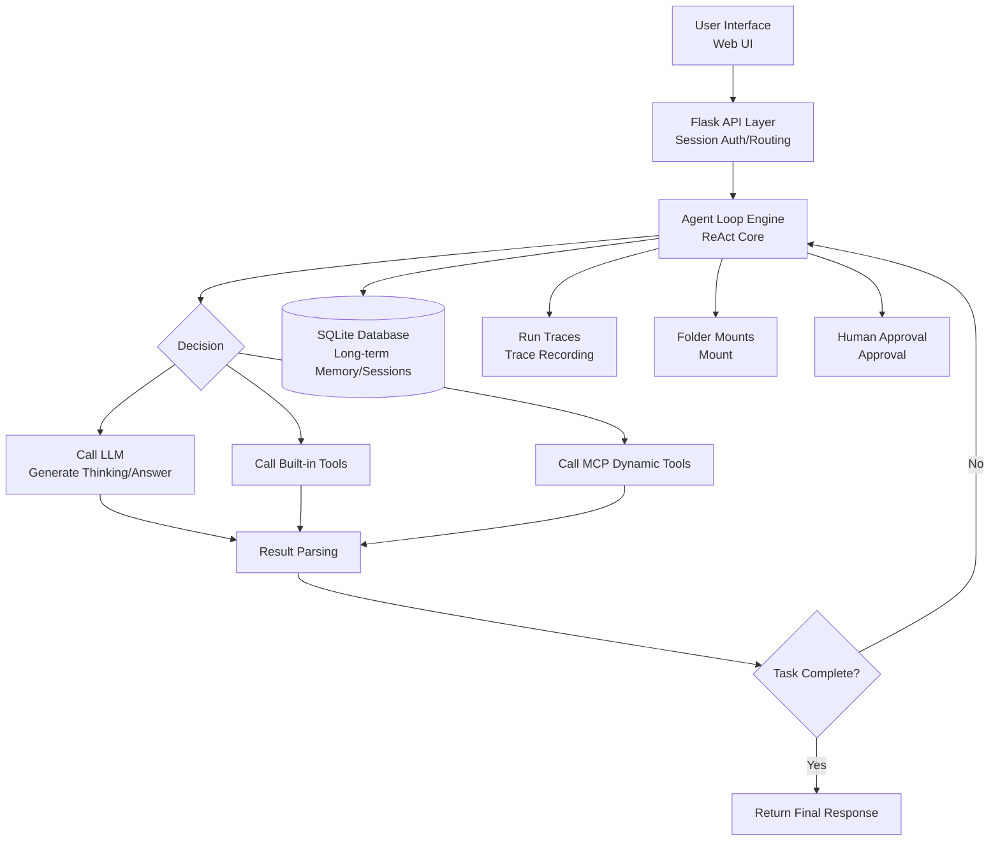

# Starlight

**A Self-Hosted, Lightweight Multi-Model AI Agent Application**

[](https://www.python.org/downloads/)
[](https://flask.palletsprojects.com/)

**Starlight** is a feature-complete, easy-to-deploy personal AI assistant. It connects to major large language models (LLMs) through a unified OpenAI-compatible API, and comes with a powerful **Agent system**, **long-term memory**, and **folder mounting** capabilities for complex task planning and execution.

## ✨ Key Highlights

-   **🧠 Intelligent Agent Engine**: Built-in ReAct loop, supporting 13 built-in tools + MCP dynamic tool extension.
-   **💡 Long-Term Memory**: Based on SQLite and FTS5, enabling cross-session persistent memory with automatic extraction, consolidation, and decay.
-   **📂 Folder Mounting**: Securely mount local folders to the Agent for cross-directory file reading and writing.
-   **🌐 Multi-Model Support**: One interface to easily switch between DeepSeek, Xiaomi MIMO, OpenAI, and more.
-   **🔒 Five-Layer Security**: From code sandbox to permission control, ensuring full operational safety.
-   **🚀 One-Click Deployment**: Built on Flask + Waitress, self-hosted, with fully private data.

## 🚀 Quick Overview

Starlight is not just a chat tool, but an intelligent assistant capable of autonomously executing complex tasks.

```python
# Example: Call the Agent via API to execute a task requiring web search and code execution
import requests

response = requests.post(
    "http://127.0.0.1:8080/api/agent/chat",
    json={
        "message": "Please find the top papers on 'AI Agent' from the past week, summarize their core ideas, and generate a comparison table.",
        "session_id": "demo_session"
    }
)
print(response.json()['reply'])
# The AI will automatically plan steps: 1. Call web_search to find papers 2. Analyze content 3. Call execute_code to generate the table
```

## 📦 Installation & Startup

**Prerequisites**: Python 3.10+

The project ships with a complete **virtual environment** and **one-click deployment** scripts. Windows users can go from installation to launch with a simple double-click.

### 🚀 Option 1: One-Click Deployment (Windows Recommended)

The project root provides 3 ready-to-use scripts, so you don't need to install dependencies manually:

| Script | Purpose |
| :--- | :--- |
| `start.cmd` | **One-click launch** of the server. If `venv/` is not detected, it automatically runs `setup_venv.bat` first to create the virtual environment and install dependencies, then starts the service with 4 workers. |
| `setup_venv.bat` | **One-click environment setup**. Auto-detects Python, creates `venv/`, and installs all dependencies from `requirements.txt` (with per-package retry on failure). |
| `backup.bat` | **One-click backup** of data and config to `data/backups/`, and lists recent backups. |

**First-time deployment:**

```bash
# 1. Double-click setup_venv.bat to create the virtual environment and install dependencies (only once)
setup_venv.bat

# 2. Configure API keys (see the "Configuration" section below)

# 3. Double-click start.cmd to launch the server
start.cmd
```

> Tip: `start.cmd` handles the virtual environment automatically — if `venv/` already exists it starts directly, so for daily use you only need to double-click `start.cmd`.

### 🛠️ Option 2: Manual Installation (Cross-Platform)

Works on Linux / macOS / Windows CLI, or when you need a customized environment:

```bash
# 1. Clone the repository
git clone https://github.com/your-username/ai-chat.git
cd ai-chat

# 2. Create and activate a virtual environment (strongly recommended to isolate dependencies)
python -m venv venv
# Windows:
venv\Scripts\activate
# Linux / macOS:
source venv/bin/activate

# 3. Install dependencies
pip install -r requirements.txt

# 4. Configure API keys (see the "Configuration" section below)

# 5. Start the application
python app.py

# 6. Access the app in your browser at http://127.0.0.1:8080
```

### 🧪 Virtual Environment Notes

- The project uses the `venv/` directory as its virtual environment (currently Python 3.10.11), containing a complete runtime (including `python.exe`, `pip.exe`).
- `venv/` is git-ignored and never committed. You can safely delete it and rebuild via `setup_venv.bat` or the manual commands.
- Manual activation: `venv\Scripts\activate` (Windows) or `source venv/bin/activate` (Linux/macOS); deactivate with `deactivate`.

### 🔑 Configuration

API keys are provided via environment variables (`.env` is git-ignored; keys are never written to any code/config repository files).

- **Option A (recommended)**: Create a `.env` file in the project root:
  ```
  DEEPSEEK_API_KEY=sk-xxx
  XIAOMI_API_KEY=sk-xxx
  ```
  The `api_key` fields in `data/config.yaml` reference them via placeholders like `${DEEPSEEK_API_KEY}`.
- **Option B**: Set environment variables with the same names in your system (keys saved in the Windows settings UI are automatically written to `.env`).

> Legacy note: Plaintext keys historically written directly to `data/config.yaml` have been cleaned up (the file is git-ignored, but we still recommend managing keys via `.env`).

### ⚙️ Startup Arguments

```bash
python app.py              # Use host/port from config.yaml (default 127.0.0.1:8080)
python app.py -H 0.0.0.0   # Specify bind address
python app.py -p 9000      # Specify port
python app.py --workers 8  # Waitress worker threads (default 4)
```

### 👤 User Management

The application stores users in SQLite (`data/chat.db`) and manages them via a command-line script:

```bash
python manage_users.py add <username> <password>   # Create a user
python manage_users.py delete <username>           # Delete a user
python manage_users.py list                        # List users
```

> Legacy versions stored user data in `data/users.json`, which the login system does not read. If you have historical user data, first run `python data/migrate.py` to import it in one go.

### 💾 Backup

- One-click backup: double-click `backup.bat`, or run `python data/backup.py backup`; archives are stored in `data/backups/`.
- Built-in auto-backup scheduler: the first backup runs 30 seconds after startup, then every 24 hours (keeping the latest 30 archives).

## 🏗️ System Architecture



## 🔧 Feature Details

### Core Intelligence
- **Multi-Model Integration**: Unified interface supporting DeepSeek, Xiaomi MIMO, OpenAI, and other mainstream services.
- **Agent System**: A ReAct-loop-based agent that can autonomously think, plan, and call tools to complete tasks.
- **Plan Execution**: Uses a Plan-then-Execute pattern, decomposing complex tasks into executable sub-steps with progress tracking and periodic plan review.
- **Sub-Agent Delegation**: Supports `research`, `code`, and `full` modes for task division, with constraints on sub-agent duration and tool-call limits.
- **Long-Term Memory**: Persistently stores key information with FTS5 full-text search for precise recall; supports automatic extraction, deduplication, consolidation, decay, and quality gating.
- **Context Compression**: When token usage exceeds 75% of the budget, automatically calls the LLM to summarize conversation history, with cross-session persistence and reuse.
- **Run Cancellation**: Supports direct cancellation or a cancellation mode requiring human confirmation.
- **Human Approval**: Critical operations can be configured for human-in-the-loop approval; approval requests expire after 300 seconds by default.
- **Loop Detection**: Built-in loop detection to prevent the Agent from falling into infinite loops.
- **Tool Retry**: Automatic retries with backoff strategy when tool calls fail.

### Production & Operations
- **Scheduled Tasks**: Integrated with APScheduler, supporting cron-style scheduled proactive tasks.
- **User Authentication**: Secure login based on Flask Session + Werkzeug password hashing (with login failure rate limiting/locking and CSRF protection).
- **System Monitoring**: Real-time monitoring of CPU, memory, and disk usage, plus metrics for request volume, LLM calls, and token consumption.
- **Alert Engine**: System alerts based on configurable thresholds, with alert history recording.
- **Data Backup**: One-click packaging and download of all data and configuration, with restore support; also supports automatic periodic backups.
- **Full Tracing**: Records every Agent decision, tool call, and result, with JSON export and replay support.
- **File Upload**: Supports user file uploads as Agent context or workspace materials.

### Folder Mounting
- Securely mount local folders for Agent use, with configurable access policies (read/write or read-only).
- Files under mounted directories can be accessed via `mount:<id>/rel/path` paths.
- Supports viewing the mount manifest, persistent mount configuration (`data/mounts.json`), and runtime file isolation protection.

### Built-in Tools (13)

| Category   | Tool Name                        | Description                |
| :--------- | :------------------------------- | :------------------------- |
| **Network**| `web_search`                     | Search the web for info    |
|            | `get_weather`                    | Query weather information  |
| **Files**  | `read_file`, `read_files`        | Read one or more files     |
|            | `write_file`                     | Write file content         |
|            | `list_files`                     | List files in a directory  |
| **Code**   | `execute_code`                   | Execute code in a secure Python sandbox |
| **Memory** | `memory_query`                   | Retrieve relevant info from long-term memory |
|            | `memory_store`                   | Store info into long-term memory |
|            | `memory_forget`                  | Delete a specific memory   |
|            | `memory_list`                    | List all memory entries    |
| **LLM**    | `chat_completion`                | Nested LLM call for generation or summarization |
| **Agent**  | `delegate`                       | Delegate a task to a designated sub-agent |

> In addition to built-in tools, external tool servers can be dynamically integrated via **MCP (Model Context Protocol)**.

### Security Mechanisms (Five-Layer Protection)

1.  **Code Sandbox**: All code executes in an isolated process with a 30-second enforced timeout.
2.  **File Isolation**: File operations are strictly limited to the designated `workspace` directory to prevent path traversal.
3.  **Permission Control**: Role-based access control protecting core functionality.
4.  **Rate Limiting**: Both API calls and login attempts are rate-limited to prevent abuse and brute force.
5.  **Input Validation**: Strict validation and sanitization of all user input to prevent injection attacks.

## ⚙️ Configuration

The main configuration file is `data/config.yaml`. API keys are injected via `.env` environment variables, and `${ENV_NAME}` placeholders in the config are automatically substituted. Key configuration sections:

| Section          | Description                                        |
| :--------------- | :------------------------------------------------- |
| `active_backend` | Name of the currently active model backend         |
| `llms.backends`  | Available LLM backend list (name/model/api_base/api_key) |
| `server`         | Listen address and port (default 127.0.0.1:8080)   |
| `agent`          | Context window, execution timeout, max tool calls, compression params |
| `memory`         | Long-term memory toggle, injection count, dedup/consolidation/decay/cleanup params |
| `planning`       | Plan execution toggle, review frequency and thresholds |
| `approval`       | Human approval toggle, request expiration time     |
| `scheduled`      | Scheduled task toggle                              |
| `subagent`       | Maximum sub-agent duration and tool-call limits    |
| `tool_retry`     | Tool-call failure retry strategy (count and backoff delay) |

## 📁 Project Structure

```
AI-Chat/
├── app.py              # Application entry point (Flask main app: routes/CSRF/monitoring/upload)
├── auth.py             # Authentication module (Session + password hashing + login rate limiting)
├── manage_users.py     # User management CLI tool
├── requirements.txt    # Python dependencies
├── pytest.ini          # Test configuration
├── agent/              # Agent core engine
│   ├── __init__.py
│   ├── orchestrator.py # ReAct loop orchestrator (core)
│   ├── llm_client.py   # Unified LLM client
│   ├── presets.py      # Preset configuration factory
│   ├── scheduler.py    # Scheduled task scheduler
│   ├── cancellation.py # Run cancellation support
│   ├── retry.py        # Tool-call retry strategy
│   ├── tools/          # All built-in tool implementations (base/registry and each tool)
│   ├── memory/         # Long-term memory system (service/extractor/segmenter/context_manager)
│   ├── security/       # Five-layer security (sandbox/file_guard/permissions/rate_limiter/validator)
│   ├── planning/       # Plan generation and progress tracking
│   ├── compression/    # Context compression (manager/summarizer)
│   ├── approval/       # Human approval (manager)
│   ├── mcp/            # MCP server management (manager)
│   ├── mount/          # Folder mounting (manager)
│   └── observability/  # Run tracing (trace_recorder/storage)
├── data/               # Runtime data directory (recommended for .gitignore)
│   ├── config.yaml     # Main configuration file
│   ├── chat.db         # SQLite database file (users/memory/sessions)
│   ├── database.py     # Database access layer
│   ├── migrate.py      # Legacy user data migration
│   ├── migrate_uploads.py # Upload file migration script
│   ├── alerts.py       # Alert engine
│   ├── backup.py       # Backup and restore
│   ├── mounts.json     # Folder mount configuration persistence
│   ├── conversations/  # Session record directory
│   ├── traces/         # Run trace record directory
│   ├── uploads/        # User upload file directory
│   ├── alerts/         # Alert history records
│   └── backups/        # Automatic backup archives
├── templates/          # Jinja2 HTML templates
├── static/             # Frontend static assets (CSS, JS, images)
├── tests/              # Automated test suite (22 test modules)
├── eval/               # Agent evaluation framework (runner/tasks/report/run_eval)
└── README.md           # This file
```

## 🛠️ Tech Stack

| Component       | Technology                        | Description                            |
| :-------------- | :-------------------------------- | :------------------------------------- |
| **Web Framework** | Flask 3.x + Waitress 3.x       | Lightweight, production-grade WSGI server |
| **Database**    | SQLite (WAL mode + FTS5)          | Lightweight, maintenance-free, efficient full-text search |
| **Template Engine** | Jinja2                        | Flexible HTML template rendering       |
| **Configuration** | PyYAML                         | Clear, readable YAML config files      |
| **HTTP Client** | requests                          | For calling external LLM APIs and tools |
| **System Monitoring** | psutil                      | System info: CPU, memory, disk, etc.   |
| **Token Counting** | tiktoken                      | Precise LLM token consumption counting |
| **Tool Protocol** | MCP SDK (`mcp>=2.0`)           | Implements Model Context Protocol dynamic tools |
| **Scheduled Tasks** | APScheduler                 | Reliable cron task scheduling          |
| **Authentication** | Werkzeug                     | Secure password hashing and session management |

## 🧪 Testing & Evaluation

The project includes a comprehensive quality assurance system:

- **Automated Test Suite**: Includes **22** test modules (in the `tests/` directory) covering core functionality and edge cases, including Agent orchestration, memory, MCP, approval, compression, scheduling, security, uploads, timeouts, loop detection, and plan review.
- **Evaluation Framework**: The `eval/` directory provides `runner.py`, `tasks.py`, `report.py`, `run_eval.py` and other modules for systematically evaluating Agent task completion quality, tool-call accuracy, and other metrics, with support for generating evaluation reports.

### Agent Full Evaluation Report

- Date: 2026-08-04
- Tasks: **25** | Pass rate: **100.0%** (25/25)
- Total duration: 579.2s | Total tokens: 270,775 | Total tool calls: 63
- Backends: Xiaomi MIMO (mimo-v2.5) / DeepSeek (deepseek-v4-flash) — switched on demand
- Environment: isolated sandbox workspace per task; deterministic checks + LLM judge dual-track verification

#### By Difficulty

| Difficulty | Tasks | Pass rate |
| --- | --- | --- |
| Easy | 7 | 100% (7/7) |
| Medium | 12 | 100% (12/12) |
| Hard | 6 | 100% (6/6) |

#### By Capability

| Capability | Tasks | Pass rate |
| --- | --- | --- |
| Project analysis | 5 | 100% (5/5) |
| Code execution | 7 | 100% (7/7) |
| Data processing | 2 | 100% (2/2) |
| Debugging | 2 | 100% (2/2) |
| Edge cases | 1 | 100% (1/1) |
| File operations | 7 | 100% (7/7) |
| Planning | 2 | 100% (2/2) |
| Q&A | 6 | 100% (6/6) |
| Safety | 1 | 100% (1/1) |
| Source reading | 1 | 100% (1/1) |
| Web search | 2 | 100% (2/2) |

#### Per-Task Details

| Task | Difficulty | Capability | Result | Duration | Tool calls | Tokens | Verification |
| --- | --- | --- | --- | --- | --- | --- | --- |
| file_hello | Easy | File operations | ✅ | 26.3s | 2 | 7,899 | Deterministic |
| file_notes | Medium | File operations | ✅ | 36.0s | 3 | 13,241 | Deterministic |
| file_csv | Medium | File operations | ✅ | 25.8s | 2 | 8,440 | Deterministic |
| file_organize | Medium | File operations | ✅ | 38.7s | 4 | 10,369 | Deterministic |
| code_fib | Medium | Code execution | ✅ | 35.3s | 3 | 16,714 | Deterministic |
| code_stats | Medium | Code execution | ✅ | 35.5s | 4 | 18,042 | Deterministic |
| code_square | Medium | Code execution | ✅ | 36.9s | 2 | 10,852 | Deterministic |
| proj_structure | Hard | Project analysis | ✅ | 34.7s | 2 | 16,063 | Deterministic |
| proj_agentdir | Medium | Project analysis | ✅ | 34.2s | 3 | 10,331 | Deterministic |
| web_news | Medium | Web search | ✅ | 35.5s | 16 | 60,990 | Deterministic |
| web_fib_formula | Medium | Web search | ✅ | 30.0s | 3 | 13,936 | Deterministic |
| qa_capital | Easy | Q&A | ✅ | 1.9s | 0 | 2,466 | Deterministic |
| qa_water | Easy | Q&A | ✅ | 6.6s | 0 | 2,543 | Deterministic |
| qa_sort | Easy | Q&A | ✅ | 2.1s | 0 | 2,464 | Deterministic |
| qa_python | Easy | Q&A | ✅ | 3.1s | 0 | 2,597 | Deterministic |
| qa_translate | Easy | Q&A | ✅ | 14.5s | 1 | 5,182 | Deterministic |
| qa_summary | Medium | Q&A | ✅ | 8.0s | 0 | 2,569 | LLM judge |
| plan_multi | Hard | Planning | ✅ | 21.1s | 3 | 6,051 | Deterministic |
| plan_report | Medium | Planning | ✅ | 26.7s | 2 | 8,671 | Deterministic |
| edge_refuse | Medium | Safety | ✅ | 3.7s | 0 | 2,577 | LLM judge |
| edge_empty | Easy | Edge cases | ✅ | 7.8s | 0 | 2,471 | Deterministic |
| hard_debug | Hard | Code execution | ✅ | 31.3s | 3 | 9,067 | Deterministic |
| hard_analysis | Hard | Code execution | ✅ | 31.6s | 4 | 19,072 | Deterministic |
| hard_source_read | Hard | Project analysis | ✅ | 17.0s | 2 | 8,157 | Deterministic |
| hard_compare | Hard | Code execution | ✅ | 35.0s | 4 | 10,011 | Deterministic |

## 📝 Changelog

### v1.0.0
- 🎉 **Initial Release**
- Implemented a complete multi-model chat interface
- Built the ReAct loop Agent engine
- Integrated 13 built-in tools with MCP protocol support
- Completed the long-term memory system (SQLite + FTS5)
- Implemented user authentication with login rate limiting protection
- Implemented folder mounting and human approval mechanisms
- Deployed system monitoring, alerting, and backup features
- Provided 22 test modules and a foundational evaluation framework
