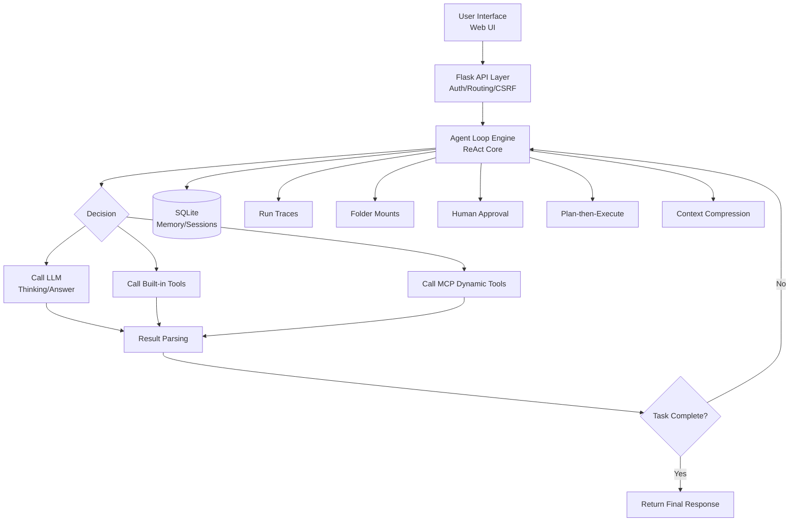

# Starlight

[中文](README.md)

**A self-hosted, out-of-the-box multi-model AI agent application** — from everyday Q&A to autonomous complex-task execution, all in one app.

[](https://www.python.org/downloads/)
[](https://flask.palletsprojects.com/)
[](https://www.sqlite.org/)
[](tests/)

**Starlight** is not another chat toy — it is a complete **Agent engineering platform**: a built-in ReAct loop, plan execution, long-term memory, context compression, sub-agents, human approval, MCP extension, observability, and an evaluation framework. It upgrades a large model from a "conversation tool" into an "autonomous worker".

---

## 🥇 Differences & Advantages vs. Other Agent Projects

Most agent projects suffer from three problems: **chat-only** (no real tool-call loop), **heavy framework, light delivery** (complex deployment, no UI, no evaluation), or **single-purpose** (only code, or only retrieval). Starlight is designed to solve all three at once:

### 1. Full-Stack Agent Capability — No "Shell-Game" Assembly

| Capability | Most ChatUI / Agent Projects | **Starlight** |
| :--- | :--- | :--- |
| Tool calling | 1–2 demo tools | **14 built-in tools** + MCP dynamic extension: files / code / web / memory / sub-agents |
| Complex tasks | Single-round ReAct, no planning | **Plan-then-Execute**: LLM decomposes → progress tracking → periodic LLM review & correction |
| Long conversations | Truncation loses context | **Context compression**: auto-LLM-summarize past 75% budget, persisted & reused across sessions |
| Long-term memory | None | **SQLite+FTS5 memory store**: auto-extraction, dedup, conflict resolution, consolidation, decay, quality gates |
| Multi-step tool flows | Unprotected | Loop detection, failure-loop circuit breaker, tool retry, budget caps, timeout fallbacks |

### 2. Real Human-in-the-Loop — Not Just an On/Off Switch

- **Approval memory**: approve once and the agent won't ask again for the same tool within the run (rejections remembered too) — long tasks don't become nagging.
- **Cancel mid-run**: even while the LLM call is blocking, cancellation works; task mode asks for confirmation first.
- **Configurable approval**: write_file / execute_code / memory_forget / delegate can require approval; requests auto-expire after 300s.

### 3. Observable & Evaluable — You Can See What the Agent Is Thinking

- **Streaming reasoning**: the model's thinking renders in real time (collapsible 💭), tool activity shown line by line — every step is traceable.
- **Full trace replay**: LLM calls, tool chains, token usage, finish reasons — recorded, exported as JSON, great for post-mortems.
- **Built-in eval framework**: 25 tasks (easy/medium/hard × 11 capability domains), deterministic checks + LLM judge dual-track verification, **100% pass rate**.

### 4. Deploy Simple Enough to Double-Click, Yet Fully Featured

- **Zero framework weight**: Flask + SQLite + vanilla JS — no Node build step, no Docker requirement, no microservices.
- **Windows one-click deployment**: `setup_venv.bat` + `start.cmd`.
- **Production-grade extras**: auth/CSRF/rate-limiting, system monitoring, alerts, auto-backup, cron scheduled tasks, file uploads, multi-user.
- **Fully private data**: everything in local SQLite; keys via `.env` env vars — never plaintext on disk.

### 5. Security Is Not a Slogan — It's Five Layers

Code sandbox (isolated process + timeout), file path isolation (anti-traversal), role-based permissions, API/login rate limiting, input validation — all covered by tests.

> **TL;DR**: Starlight is "a production-grade agent platform one person can maintain" — the chat experience of ChatGPT, engineering depth approaching enterprise frameworks, at a tenth of their complexity.

---

## ✨ Key Highlights

- **🧠 Intelligent Agent Engine**: ReAct loop + plan execution + progress review; 14 built-in tools + MCP dynamic extension.
- **💡 Long-Term Memory**: SQLite + FTS5; auto-extraction, dedup, conflict resolution, consolidation, decay.
- **📂 Folder Mounting**: securely mount local folders, conversation-scoped, configurable access policies.
- **🎯 Human Approval**: human-in-the-loop for critical ops, with approval memory and cancellation.
- **🌐 Multi-Model Support**: switch between DeepSeek, Xiaomi MIMO, OpenAI, etc. (any OpenAI-compatible API).
- **📊 Fully Observable**: streaming reasoning, trace replay, evaluation framework.
- **🔒 Five-Layer Security**: from code sandbox to permission control.
- **🚀 One-Click Deployment**: Flask + Waitress, self-hosted, fully private data.

## 🚀 Quick Start

Starlight is not just a chat tool — it's an assistant that can autonomously execute complex tasks:

```python
import requests

response = requests.post(
    "http://127.0.0.1:8080/api/agent/chat",
    json={
        "message": "Find the top papers on 'AI Agent' from the past week, summarize their core ideas, and generate a comparison table.",
        "session_id": "demo_session"
    }
)
print(response.json()['reply'])
# The AI will: 1. plan steps 2. web_search for papers 3. analyze 4. execute_code to build the table
```

In the web UI you can watch the model's **reasoning stream in real time** and see each **tool call activity** — full transparency.

## 📦 Installation & Startup

**Prerequisites**: Python 3.10+

### 🚀 Option 1: One-Click Deployment (Windows Recommended)

| Script | Purpose |
| :--- | :--- |
| `start.cmd` | **One-click launch**. Auto-runs `setup_venv.bat` if `venv/` is missing, then starts with 4 workers. |
| `setup_venv.bat` | **One-click environment setup**. Auto-detects Python, creates `venv/`, installs all deps (per-package retry). |
| `backup.bat` | **One-click backup** to `data/backups/`. |

```bash
setup_venv.bat   # 1. First time: create venv + install dependencies
# 2. Configure API keys (below)
start.cmd        # 3. Daily: just double-click
```

### 🛠️ Option 2: Manual Installation (Cross-Platform)

```bash
git clone https://github.com/your-username/ai-chat.git
cd ai-chat
python -m venv venv
# Windows: venv\Scripts\activate   Linux/macOS: source venv/bin/activate
pip install -r requirements.txt
python app.py    # open http://127.0.0.1:8080
```

### 🔑 Configuration

API keys are provided via environment variables (`.env` is git-ignored; keys are never written to any code/config repo files):

- **Option A (recommended)**: create `.env` in the project root:
  ```
  DEEPSEEK_API_KEY=sk-xxx
  XIAOMI_API_KEY=sk-xxx
  ```
  Reference them in `data/config.yaml` with `${DEEPSEEK_API_KEY}` placeholders.
- **Option B**: set the same env vars in your system (keys saved in the settings UI are written to `.env` automatically).

### ⚙️ Startup Arguments

```bash
python app.py              # host/port from config.yaml (default 127.0.0.1:8080)
python app.py -H 0.0.0.0   # bind address
python app.py -p 9000      # port
python app.py --workers 8  # Waitress worker threads (default 4)
```

### 👤 User Management

```bash
python manage_users.py add <username> <password>   # create user
python manage_users.py delete <username>           # delete user
python manage_users.py list                        # list users
```

> Legacy `data/users.json` data can be imported with `python data/migrate.py`.

### 💾 Backup

- Manual: double-click `backup.bat` or `python data/backup.py backup` → `data/backups/`.
- Automatic: first backup 30s after startup, then every 24h (keeps last 30 archives).

## 🏗️ System Architecture



## 🔧 Feature Details

### Core Intelligence
- **Multi-Model Integration**: unified OpenAI-compatible interface; DeepSeek, Xiaomi MIMO, OpenAI, etc., switchable from the UI.
- **Agent System**: ReAct loop with autonomous thinking, planning, and tool calling.
- **Plan Execution**: Plan-then-Execute decomposition, progress tracking + periodic LLM review (marks missed steps, corrects false positives).
- **Sub-Agent Delegation**: `research` / `code` / `full` modes; child agents have independent budgets (25 calls / 300s); no nesting.
- **Long-Term Memory**: FTS5 full-text recall; auto-extraction, dedup, conflict resolution, consolidation, decay, quality gates.
- **Context Compression**: auto-LLM-summarize past 75% of the token budget; skips when gain is insufficient; persisted across sessions.
- **Run Cancellation**: interruptible even during blocking LLM calls; task mode requires confirmation.
- **Human Approval**: configurable for write_file/execute_code/memory_forget/delegate; 300s expiry; approval memory prevents nagging.
- **Loop Protection**: identical-call loop detection, 8-failure circuit breaker, empty-arg threshold, retry backoff, 300-call budget, 600s timeout.

### Production & Operations
- **Scheduled Tasks**: APScheduler + cron expressions; results written back into the conversation; manual trigger + history.
- **User Authentication**: Session + Werkzeug hashing; login rate limiting/locking + CSRF.
- **System Monitoring**: CPU/memory/disk, request volume, LLM calls, token consumption.
- **Alert Engine**: configurable threshold alerts with history.
- **Data Backup**: one-click backup/restore, automatic periodic backups.
- **Full Tracing**: every decision, tool call, and result recorded; replay page; JSON export.
- **File Upload**: conversation-scoped; multimodal images (when the model supports vision); text/code files injected into context.

### Folder Mounting
- Securely mount local folders with read-write / read-only / always-ask policies.
- **Conversation-scoped**: mounts belong to the conversation they were made in — no leakage when switching.
- Mounted files ride along as attachments with manifests; `data/mounts.json` persists config.

### Skill System
- `skills/` directory is plug-and-play: each subdirectory with a `SKILL.md` is a skill.
- Conversation-level skill injection (as an extra system message); preselectable, follows the conversation.

### Built-in Tools (14)

| Category | Tool | Description |
| :--- | :--- | :--- |
| **Network** | `web_search` / `get_weather` | Web search / weather |
| **Files** | `read_file` / `read_files` / `write_file` / `list_files` | Read/write files, batch read, list dir |
| **Code** | `execute_code` | Python code in an isolated sandbox |
| **Memory** | `memory_query` / `memory_store` / `memory_forget` / `memory_list` | CRUD for long-term memory |
| **LLM** | `chat_completion` | Nested LLM call (generate/summarize) |
| **Agent** | `delegate` | Delegate a task to a sub-agent |

> External tool servers can be dynamically integrated via **MCP (Model Context Protocol)** — stdio / HTTP transports, hot-reload config.

### Security Mechanisms (Five-Layer Protection)

1. **Code Sandbox**: isolated process, enforced timeout; runtime blocking of destructive operations (remove/rename/system etc.); deletions outside the workspace rejected.
2. **File Isolation**: file ops strictly limited to the workspace; path-traversal protected.
3. **Permission Control**: role-based access (USER/GUEST/ADMIN), tool-level permission categories.
4. **Rate Limiting**: API calls and login attempts rate-limited against abuse and brute force.
5. **Input Validation**: strict validation and sanitization against injection.

## ⚙️ Configuration

Main config: `data/config.yaml`; keys via `.env` (`${ENV_NAME}` placeholders auto-substituted). Key sections:

| Section | Description |
| :--- | :--- |
| `active_backend` | Currently active model backend |
| `llms.backends` | LLM backend list (name/model/api_base/api_key) |
| `server` | Listen address & port |
| `agent` | Context window, execution timeout, max tool calls, compression params |
| `memory` | Memory toggle, injection count, dedup/conflict/consolidation/decay/cleanup |
| `planning` | Plan execution toggle, review frequency & thresholds |
| `approval` | Approval toggle, expiry, approval memory |
| `scheduled` | Scheduled task toggle |
| `subagent` | Sub-agent duration & call limits |
| `tool_retry` | Tool retry policy (count & backoff) |

## 📁 Project Structure

```
AI-Chat/
├── app.py              # Flask main app (routes/CSRF/monitoring/upload/streaming)
├── auth.py             # Auth module (Session + hashing + login rate limiting)
├── manage_users.py     # User management CLI
├── requirements.txt    # Dependencies
├── pytest.ini          # Test config
├── agent/              # ★ Agent core engine
│   ├── orchestrator.py # ReAct loop orchestrator (core)
│   ├── llm_client.py   # Unified LLM client (multimodal/vision detection)
│   ├── presets.py      # Preset config factory
│   ├── scheduler.py    # Scheduled task scheduler
│   ├── cancellation.py # Run cancellation (interruptible blocking calls)
│   ├── retry.py        # Tool retry policy
│   ├── tools/          # 14 built-in tools
│   ├── memory/         # Long-term memory (service/extractor/segmenter/context_manager)
│   ├── security/       # Five-layer security (sandbox/file_guard/permissions/rate_limiter/validator)
│   ├── planning/       # Plan generation + tracking + LLM review
│   ├── compression/    # Context compression (manager/summarizer)
│   ├── approval/       # Human approval (manager)
│   ├── mcp/            # MCP server management
│   ├── mount/          # Folder mounting
│   └── observability/  # Run tracing (trace_recorder/storage)
├── data/               # Runtime data (config.yaml/chat.db/backups/...)
├── skills/             # ★ Skill directory (each subdir = one skill)
├── templates/          # Jinja2 templates (index/traces/scheduled/login)
├── static/             # Frontend assets (CSS/JS/images)
├── tests/              # 23 test modules, 270+ cases
├── eval/               # ★ Agent eval framework (runner/tasks/report/run_eval)
└── README.md
```

## 🛠️ Tech Stack

| Component | Technology | Description |
| :--- | :--- | :--- |
| **Web Framework** | Flask 3.x + Waitress 3.x | Lightweight, production-grade WSGI |
| **Database** | SQLite (WAL + FTS5) | Maintenance-free, efficient full-text search |
| **Template Engine** | Jinja2 | HTML rendering |
| **Configuration** | PyYAML | Readable YAML config |
| **HTTP Client** | requests | LLM APIs & tools |
| **System Monitoring** | psutil | CPU/memory/disk |
| **Token Counting** | tiktoken | Precise token stats |
| **Tool Protocol** | MCP SDK (`mcp>=2.0`) | Model Context Protocol dynamic tools |
| **Scheduled Tasks** | APScheduler | Cron scheduling |
| **Authentication** | Werkzeug | Password hashing & sessions |

## 🧪 Testing & Evaluation

### Automated Tests

- **23 test modules, 270+ cases** (`tests/`): agent orchestration, memory, planning, MCP, approval, cancellation, compression, scheduling, security, uploads, timeouts, loop detection, plan review, eval framework.
- Frontend interactions additionally covered by jsdom simulation tests (streaming reasoning rendering, approval cards, mount preselection, composer state machine, etc.).

### Agent Eval Framework (`eval/`)

- **25 eval tasks**: 7 easy / 12 medium / 6 hard across 11 capability domains (files, code, project analysis, web search, planning, Q&A, safety, edge cases...).
- Each task runs in an isolated sandbox workspace; **deterministic checks + LLM judge dual-track verification**; `--repeat N` for stability re-runs, difficulty filters.
- Reports auto-generated as Markdown + JSON (`eval/reports/`) with duration, tokens, and tool-call details.

### Full Evaluation Report (2026-08-04)

- Tasks: **25** | Pass rate: **100.0%** (25/25)
- Total duration 579.2s | total tokens 270,775 | total tool calls 63
- Backends: Xiaomi MIMO (mimo-v2.5) / DeepSeek (deepseek-v4-flash)

| Difficulty | Tasks | Pass rate | | Capability | Tasks | Pass rate |
| :--- | :--- | :--- | :--- | :--- | :--- | :--- |
| Easy | 7 | 100% | | Project analysis | 5 | 100% |
| Medium | 12 | 100% | | Code execution | 7 | 100% |
| Hard | 6 | 100% | | Data processing | 2 | 100% |
| | | | | Debugging | 2 | 100% |
| | | | | Edge cases | 1 | 100% |
| | | | | File operations | 7 | 100% |
| | | | | Planning | 2 | 100% |
| | | | | Q&A | 6 | 100% |
| | | | | Safety | 1 | 100% |
| | | | | Source reading | 1 | 100% |
| | | | | Web search | 2 | 100% |

### Per-Task Details

| Task | Difficulty | Capability | Result | Duration | Tool calls | Tokens | Verification |
| :--- | :--- | :--- | :--- | :--- | :--- | :--- | :--- |
| file_hello | Easy | File ops | ✅ | 26.3s | 2 | 7,899 | Deterministic |
| file_notes | Medium | File ops | ✅ | 36.0s | 3 | 13,241 | Deterministic |
| file_csv | Medium | File ops | ✅ | 25.8s | 2 | 8,440 | Deterministic |
| file_organize | Medium | File ops | ✅ | 38.7s | 4 | 10,369 | Deterministic |
| code_fib | Medium | Code | ✅ | 35.3s | 3 | 16,714 | Deterministic |
| code_stats | Medium | Code | ✅ | 35.5s | 4 | 18,042 | Deterministic |
| code_square | Medium | Code | ✅ | 36.9s | 2 | 10,852 | Deterministic |
| proj_structure | Hard | Project analysis | ✅ | 34.7s | 2 | 16,063 | Deterministic |
| proj_agentdir | Medium | Project analysis | ✅ | 34.2s | 3 | 10,331 | Deterministic |
| web_news | Medium | Web search | ✅ | 35.5s | 16 | 60,990 | Deterministic |
| web_fib_formula | Medium | Web search | ✅ | 30.0s | 3 | 13,936 | Deterministic |
| qa_capital | Easy | Q&A | ✅ | 1.9s | 0 | 2,466 | Deterministic |
| qa_water | Easy | Q&A | ✅ | 6.6s | 0 | 2,543 | Deterministic |
| qa_sort | Easy | Q&A | ✅ | 2.1s | 0 | 2,464 | Deterministic |
| qa_python | Easy | Q&A | ✅ | 3.1s | 0 | 2,597 | Deterministic |
| qa_translate | Easy | Q&A | ✅ | 14.5s | 1 | 5,182 | Deterministic |
| qa_summary | Medium | Q&A | ✅ | 8.0s | 0 | 2,569 | LLM judge |
| plan_multi | Hard | Planning | ✅ | 21.1s | 3 | 6,051 | Deterministic |
| plan_report | Medium | Planning | ✅ | 26.7s | 2 | 8,671 | Deterministic |
| edge_refuse | Medium | Safety | ✅ | 3.7s | 0 | 2,577 | LLM judge |
| edge_empty | Easy | Edge cases | ✅ | 7.8s | 0 | 2,471 | Deterministic |
| hard_debug | Hard | Code | ✅ | 31.3s | 3 | 9,067 | Deterministic |
| hard_analysis | Hard | Code | ✅ | 31.6s | 4 | 19,072 | Deterministic |
| hard_source_read | Hard | Project analysis | ✅ | 17.0s | 2 | 8,157 | Deterministic |
| hard_compare | Hard | Code | ✅ | 35.0s | 4 | 10,011 | Deterministic |

## 📝 Changelog

### v1.1.0
- 🎉 Repositioned: from "multi-model chat" to "full-stack agent platform"
- **Differences & advantages documented**: new "vs. other agent projects" section
- Composer state machine: empty state 3× height + hugging suggestion chips + dedicated button row (strict state machine + CSS transitions)
- Conversation-scoped mounts, mount-takes-effect immediately; Skill system (directory = skill)
- Streaming reasoning in real time, mid-run cancellation (interruptible blocking calls), approval memory
- SSE streaming (reasoning/tool activity/text), multimodal image upload (with vision fallback)
- Eval framework v2: difficulty tiers + stability re-runs (25 tasks, 100% pass)

### v1.0.0
- 🎉 **Initial Release**
- Multi-model chat UI + ReAct loop agent engine
- 14 built-in tools + MCP protocol support
- Long-term memory system (SQLite + FTS5)
- User authentication with login rate limiting
- Folder mounting + human approval
- Monitoring, alerts, backup, scheduled tasks
- 23 test modules + evaluation framework
